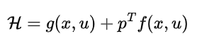
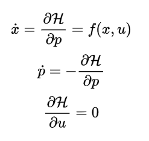

# Optimal-Control
This repo contains MATLAB codes for solving a general nonlinear optimal control problem using the gradient descent approach.

In optimal contorl theory a standard optimal control is defined as

The solution to the problem above comes from calculus of variations. A Hamiltonian function is defined as

And the optimal control input can be calcuated using the relationships below:

Here `p` denotes the costates. This set of equations is generally hard to solve, because they are two point boundary nonlinear equations. The initial values of `x` and the final values of `p` are known.
One way to solve this set of equations is using the gradient descent algorithm. An initial guess of the control input `u` is selected and the equations are solved for `x` and `p`, given the boundary values. Then `u` is corrected using the gradient of the Hamiltonian. 

This exact logic has been implemented in the function optimalControlSolver. Here, we go over the variables, inputs and outputs of the function.

Problem:
   Minimize  J = Phi(x(tf)) + ∫_0^{tf} g(x(t), u(t)) dt
   subject to ẋ = f(x,u),  x(0) = x0

 Usage:
   [sol, info] = optimalControlSolver(symF, symG, symPhi, xSym, uSym, tGrid, x0, U0, opts)

 Inputs:
- symF   : symbolic vector field f(x,u) of size [n x 1]
- symG   : symbolic scalar running cost g(x,u)
- symPhi : symbolic scalar terminal cost Phi(x)
- xSym   : symbolic state vector [x1; x2; ...; xn]
- uSym   : symbolic control vector [u1; u2; ...; um]
- tGrid  : time grid (column or row) of size [N x 1] or [1 x N], increasing, with tGrid(1 = 0)
- x0     : initial state (numeric) [n x 1]
- U0     : initial control trajectory over tGrid [N x m]
- opts   : options struct (all optional fields):
            1. maxIters      (default 50)
            2. alpha         (default 1.0)     initial step size for gradient descent
            3. beta          (default 0.5)     backtracking reduction factor (0<beta<1)
            4. c1            (default 1e-4)    Armijo condition constant
            5. tol           (default 1e-6)    stopping tolerance on ||grad_u||_F
            6. odeOptions    (default [])      options set by odeset
            7. interp        (default 'linear') 'linear' or 'zoh' for u/x interpolation
            8. uLower        (default [])      lower bounds on u (1x m) or scalar
            9. uUpper        (default [])      upper bounds on u (1x m) or scalar
            10. maxLineSearch (default 10)
            11. verbose       (default true)

Outputs:
- sol.t   : time grid [N x 1]
- sol.X   : state trajectory along tGrid [N x n]
- sol.U   : control trajectory along tGrid [N x m]
- sol.P   : costate trajectory along tGrid [N x n]
- sol.J   : final cost value at solution
- sol.J_hist : cost history per iteration
- sol.grad_norm_hist : gradient-norm history per iteration
- info.iters : number of iterations performed

Requirements:
- MATLAB Symbolic Math Toolbox

Notes:
- Instead of a simple gradient descent with a constant step size, the Armijo condition is checked every time and backtracking is used to find an appropriate step size

